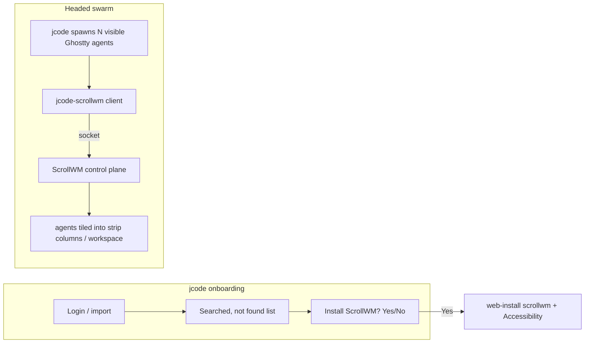

# ScrollWM x jcode integration - plan (synthesis)

Synthesized from 5 parallel explorers (docs in `explorers/`). Both repos are
yours: `1jehuang/jcode` (Rust TUI agent) and `1jehuang/scrollwm` (Swift macOS
scrolling WM). They already ship together in the `1jehuang/homebrew-jstack` tap
via a `jstack` bundle cask.

## The vision

## How the two repos link (no submodule)

- Keep two repos. The runtime coupling is a **capability handshake over
  `scrollwm status`/`version` JSON**, never a build-time dependency. jcode is the
  client; ScrollWM stays jcode-agnostic.
- Distribution link already exists: `homebrew-jstack` `jstack` cask installs both
  (`depends_on cask: scrollwm`). We just add cross-suggest caveats + a canonical
  `scrollwm/docs/INTEGRATION.md` (wire spec) that jcode links.
- Versioning: ScrollWM `status` gains `version`, `protocol` (int), `capabilities`
  / `verbs`. jcode gates optional verbs on `protocol`/`verbs`, degrades
  gracefully when absent or old.

## Workstreams (each shippable independently)

### WS1 - Onboarding: "Searched, not found" + scrolling (USER ASK #2)
Source of truth for "what we searched": `external_auth.rs`
`pending_external_auth_review_candidates` (Codex, Claude Code, Gemini CLI,
Copilot, Cursor, OpenCode, pi). Add `external_auth_search_report()` returning
`{found, not_found}` using the existing `*_exists()` presence helpers (presence,
NOT consent). Render a scrollable "Searched, not found:" panel under the decision
row in `ui_onboarding.rs` (`Paragraph::scroll((offset,0))`, offset on `App`,
keys `PgUp/PgDn`+`Ctrl-U/D`, disjoint from the Yes/No `h/l/j/k` keys). This is
the generalizable mechanism: ScrollWM later becomes one more search target.

### WS2 - Onboarding: ScrollWM install opt-in (USER ASK #1b)
New `OnboardingPhase::ScrollWmOptIn { yes_highlighted, shown_at }` inserted at the
single choke point `onboarding_show_suggestions` (split into a gate +
`onboarding_finish_to_suggestions`). macOS-only, gated on
`!scrollwm_app_installed()` (check `~/Applications/ScrollWM.app` + `/Applications`)
and a persisted `scrollwm_optin_answered` in `setup_hints.json`. Default
highlight = **No** (never install on timeout). On Yes: async install via the
web-installer (download to temp then `bash`), result delivered through a new
`Bus::ScrollWmInstallCompleted` event; Accessibility grant is ScrollWM-owned.
Renders through the existing Yes/No welcome machinery.

### WS3 - jcode-scrollwm control client (the link)
New crate `jcode-scrollwm`: blocking `UnixStream` client to
`~/Library/Application Support/ScrollWM/control.sock` (env override
`SCROLLWM_CONTROL_SOCK`), `#[cfg(not(macos))]` no-op stub. API: `is_running()`
(ping), `hello()`/`status()` (serde structs), `arrange()`, `focus_index()`,
`focus_title()`, `workspace*`, `reload_config()`. Loopback unit tests (temp
`UnixListener` echoing canned replies) - no ScrollWM needed in CI. Modeled on
`jcode-mobile-sim::send_request` + Swift `ControlClient.send`.

### WS4 - Swarm orchestration (USER ASK #1a)
After `register_visible_spawned_member` in `comm_session.rs`, `tokio::spawn` a
best-effort `reconcile_scrollwm_after_spawn`: gate on config + `is_running()`,
poll `status` to find the agent's column by **title** (jcode already sets a
unique window title via `resumed_window_title`), then `focus` it. Default does
NOT call `arrange` (that grabs the whole Space). Config:
`integrations.scrollwm { enabled=false, arrange_on_spawn=false, focus_active=true,
workspaces=false }` + `JCODE_SCROLLWM*` env. Fire-and-log; never gate spawn.

### WS5 - ScrollWM-side additions (separate scrollwm repo PR)
- `status`/`version` gains `version`+`protocol`+`capabilities`/`verbs`.
- New verbs: `arrange-pids`, `focus-title`, `focus-pid`, `workspace-new`,
  (optional, guarded) `spawn-strip`. All additive, ~5-15 lines each;
  `arrange(pidFilter:)` already exists.
- `docs/INTEGRATION.md` canonical contract + a conformance test.
- Reverse hook: a `spawn` binding (`ctrl+opt+j -> jcode`) jcode can opt-in write.

## Recommended build order

1. **WS1** (self-contained, pure jcode, immediate user value; establishes the
   scrolling + "not found" mechanism ScrollWM reuses).
2. **WS3** (the client; unit-testable offline; unblocks WS4).
3. **WS2** (onboarding opt-in; can show live ScrollWM status via WS3).
4. **WS4** (wire swarm spawn -> ScrollWM focus).
5. **WS5** (ScrollWM repo PR: handshake fields + verbs + INTEGRATION.md).

## Hard safety rules (from ScrollWM)
- Never `arrange` the real desktop in a test; use `scrollwm sandbox` +
  `SCROLLWM_CONTROL_SOCK`.
- jcode only drives the control plane; never enumerates/moves windows itself.
- Never send `close`/`release`/`quit` for the user's real arrangement.
- All ScrollWM I/O on detached tasks with short timeouts; every failure is a
  quiet no-op + one log line. ScrollWM must never gate jcode functionality.
