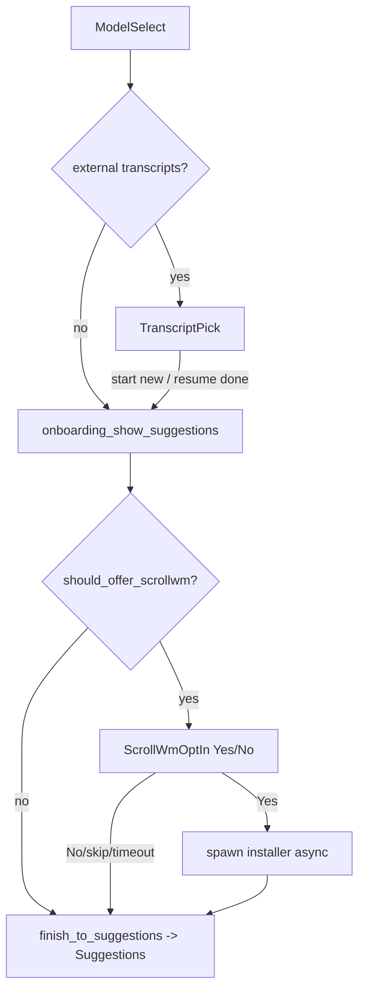

# Onboarding opt-in: install + set up ScrollWM during jcode onboarding

Explorer: `onboarding-optin`. Area: add an OPT-IN onboarding step that offers to
install ScrollWM (and grant Accessibility) while a new user is setting up jcode.
No production code changed; this is a concrete design + minimal-first-PR plan.

## TL;DR

Add one new terminal-ish onboarding phase, `ScrollWmOptIn`, that sits *after*
login/transcript and *before* `Suggestions`. It is a Yes/No decision row that
renders through the exact same welcome-screen machinery as the existing
"Log in to OpenAI?" / import prompts. It only appears on macOS, only when
ScrollWM is not already installed, and only when the user has not already
answered (persisted in `setup_hints.json`). On **Yes** we shell out to the
ScrollWM web installer asynchronously and surface progress/result via a Bus
event; the Accessibility grant is handled by ScrollWM itself on first launch, so
jcode never touches TCC. On **No**/skip/timeout we record the choice and never
ask again.

## 1. Where this slots into the state machine

Anchors:
- `crates/jcode-tui/src/tui/app/onboarding_flow.rs` - `OnboardingPhase` enum
  (lines ~145-188), `OnboardingFlow`, `DECISION_TIMEOUT` (60s).
- `crates/jcode-tui/src/tui/app/onboarding_flow_control.rs` - transitions
  (`onboarding_after_model_select` ~230, `onboarding_open_transcript_picker`
  ~630, `onboarding_show_suggestions` ~743), key handling
  (`handle_onboarding_continue_prompt_key` ~298), tick/auto-timeout
  (`onboarding_tick` ~1186).
- `crates/jcode-tui/src/tui/ui_onboarding.rs` - `welcome_body_lines` renders the
  Yes/No rows (the `LoginOpenAi` arm at lines ~185-248 is the template).
- `crates/jcode-tui/src/tui/mod.rs` - `OnboardingWelcomeKind` enum (~640-663).
- `crates/jcode-tui/src/tui/app/state_ui_input_helpers.rs` -
  `onboarding_welcome_kind()` (~1151) maps phase -> welcome kind, and
  `onboarding_flow_drives_welcome()` (~1197) lists phases that own the welcome
  body.

Current resting flow (post-login):

```
ModelSelect
  -> onboarding_after_model_select()
       external transcripts? -> TranscriptPick (resume picker)
       else                  -> onboarding_show_suggestions() -> Suggestions
```

New flow inserts the opt-in right before we land on `Suggestions`. Critically,
the opt-in must run on **both** the "has transcripts" and "no transcripts"
paths, and after the resume picker closes into a new session. The clean single
choke point is `onboarding_show_suggestions()`: every terminal path calls it
(directly, via `onboarding_fallback_to_session_search`, and from the resume
picker's "Start a new session"). So we gate there:

```
onboarding_show_suggestions()  // becomes a thin wrapper
  -> if should_offer_scrollwm() { enter ScrollWmOptIn }
     else                       { onboarding_finish_to_suggestions() }
```

Renaming the current body of `onboarding_show_suggestions` to
`onboarding_finish_to_suggestions` (the real "render suggestion cards + validate
model" work) keeps the transcript-pick code paths untouched while giving us one
insertion point. The opt-in's Yes/No answer then calls
`onboarding_finish_to_suggestions()` so the user always ends on the normal
new-session screen, regardless of choice.



## 2. Exact enum / state additions

### 2a. `OnboardingPhase` (onboarding_flow.rs)

```rust
/// Offer to install ScrollWM (a scrolling window manager that arranges jcode's
/// headed swarm agents). macOS only, shown once when ScrollWM is not already
/// installed and the user has not previously answered. Highlightable Yes/No
/// with the shared DECISION_TIMEOUT countdown; the default (and timeout choice)
/// is "No" so we never install software on a silent timeout.
ScrollWmOptIn {
    /// Which option is highlighted (true = "Yes, install ScrollWM").
    yes_highlighted: bool,
    /// When the prompt was shown, for the countdown.
    shown_at: Instant,
},
```

Default highlight is **No** here (unlike `LoginOpenAi`, whose default is Yes).
Installing third-party software is not a required step and is irreversible-ish,
so a timeout/Enter must not silently install. Set `yes_highlighted: false` on
entry.

`decision_seconds_remaining()` / `decision_timed_out()` (~288-314): add a
`ScrollWmOptIn { shown_at, .. }` arm mirroring `ContinuePrompt`.

### 2b. `OnboardingWelcomeKind` (tui/mod.rs)

```rust
/// "Install ScrollWM?" opt-in with a highlightable Yes/No selector and a live
/// decision countdown. Carries whether an install is already running so the
/// card can switch to a progress line.
ScrollWmOptIn {
    yes_highlighted: bool,
    seconds_left: u64,
    /// None = waiting for a decision; Some(state) = install in flight / result.
    progress: Option<ScrollWmInstallProgress>,
},
```

```rust
#[derive(Debug, Clone, PartialEq, Eq)]
pub enum ScrollWmInstallProgress {
    Running,                 // "Installing ScrollWM..."
    Succeeded,               // "ScrollWM installed - grant Accessibility..."
    Failed { detail: String }
}
```

### 2c. Welcome-kind mapping + gating

- `onboarding_welcome_kind()` (state_ui_input_helpers.rs ~1151): add a
  `ScrollWmOptIn` arm building `OnboardingWelcomeKind::ScrollWmOptIn { .. }`,
  reading `seconds_left` like the `ContinuePrompt` arm and `progress` from a new
  `self.scrollwm_install_progress` field (see 2d).
- `onboarding_flow_drives_welcome()` (~1197): add
  `Some(OnboardingPhase::ScrollWmOptIn { .. })` to the match so the welcome
  screen stays up during the prompt.

### 2d. `App` state + persistence helper

ScrollWM opt-in answer + install state must persist so we never nag and survive
restarts. Reuse the existing `setup_hints.json` (already the new-user signal at
onboarding_flow_control.rs ~117) via `jcode-setup-hints`'s `SetupHintsState`
(accessible from the tui crate as `crate::setup_hints::SetupHintsState` because
`jcode-app-core` re-exports `jcode_setup_hints::*` in
`crates/jcode-app-core/src/setup_hints.rs`).

Add to `SetupHintsState` (jcode-setup-hints/src/lib.rs, `#[serde(default)]` so
old files load):

```rust
/// True once the user has answered the onboarding "install ScrollWM?" prompt
/// (Yes or No or skip). When set we never show the opt-in again.
#[serde(default)]
pub scrollwm_optin_answered: bool,
/// True if they chose Yes and we kicked off (or completed) an install. Lets a
/// later launch show a "finish granting Accessibility" hint without re-asking.
#[serde(default)]
pub scrollwm_install_started: bool,
```

Transient (non-persisted) UI field on `App` for the in-flight progress line:

```rust
scrollwm_install_progress: Option<ScrollWmInstallProgress>,
```

## 3. Detection: is ScrollWM already installed?

Pure, cheap, no subprocess. Matches the README install locations
(`~/Applications` default, `/Applications` via `SCROLLWM_DEST`):

```rust
#[cfg(target_os = "macos")]
fn scrollwm_app_installed() -> bool {
    let home = std::env::var_os("HOME").map(std::path::PathBuf::from);
    let candidates = [
        home.map(|h| h.join("Applications/ScrollWM.app")),
        Some(std::path::PathBuf::from("/Applications/ScrollWM.app")),
    ];
    candidates.into_iter().flatten().any(|p| p.is_dir())
}
#[cfg(not(target_os = "macos"))]
fn scrollwm_app_installed() -> bool { false }
```

Live-verified on this machine: `~/Applications/ScrollWM.app` exists, so on this
box the opt-in would self-suppress, which is the desired behavior. We can
additionally detect a `scrollwm` CLI on PATH (`install.sh` symlinks it), but the
`.app` check is the canonical signal and avoids PATH ambiguity.

`should_offer_scrollwm()` combines everything:

```rust
fn should_offer_scrollwm(&self) -> bool {
    cfg!(target_os = "macos")
        && !self.is_remote                       // local TUI only; AX is local
        && !self.onboarding_preview_mode_skip()  // honor preview semantics
        && !scrollwm_app_installed()
        && !SetupHintsState::load().scrollwm_optin_answered
}
```

Remote/client sessions are excluded: ScrollWM + Accessibility are inherently
about the local desktop, and the swarm-arrange integration (other explorers)
only makes sense where the headed terminals actually live.

## 4. Render sketch (matches existing Yes/No rows)

New arm in `welcome_body_lines` (ui_onboarding.rs), structurally identical to
the `LoginOpenAi` arm (lines ~185-248). Decision state:

```
            Set up ScrollWM?                         (welcome_accent, bold)
  jcode can arrange your swarm agents into a tidy    (dim)
  scrolling strip. One permission (Accessibility).   (dim)

        Yes            No                             (No highlighted by default)

  Left/right or h/l to move, Enter or Space to choose (y / n also work).   (dim)
  Skips automatically in 60s.                          (dim)
```

The Yes/No row reuses the exact span recipe already in the file:

```rust
let (yes_style, no_style) = if yes_highlighted { /* yes reversed/bold */ }
                            else               { /* no reversed/bold  */ };
lines.push(Line::from(vec![
    Span::styled("  Yes  ", yes_style),
    Span::raw("   "),
    Span::styled("  No  ", no_style),
]).alignment(align));
```

Install-in-flight state (`progress = Some(Running)`) replaces the Yes/No row
with a single status line so the card stops accepting input visually:

```
        Installing ScrollWM... (this opens a menu-bar app)        (welcome_accent)
  When it finishes, grant Accessibility in System Settings.       (dim)
```

`Succeeded` / `Failed { detail }` render a one-line ✓/✕ result before the flow
advances to `Suggestions`. We keep the donut + telemetry header above, exactly
like the other phases (handled by `draw_onboarding_welcome`, no change needed).

Status-bar notice mirrors `update_onboarding_login_openai_status`:
`"Set up ScrollWM? [No] - hl to move, Enter to choose, skips in {n}s"`.

## 5. Key handling + transitions (onboarding_flow_control.rs)

- In `handle_onboarding_continue_prompt_key` (~298), add a
  `Some(OnboardingPhase::ScrollWmOptIn { .. })` arm calling a new
  `handle_onboarding_scrollwm_optin_key`, gated `if self.scrollwm_install_progress.is_none()`
  (ignore keys while an install is running; mirror the `inline_interactive_state`
  guard used by the other arms).
- `handle_onboarding_scrollwm_optin_key`: copy
  `handle_onboarding_login_openai_key` (~462) verbatim - Left/h -> Yes,
  Right/l -> No, Up/Down/k/j/Tab toggle, y/n commit, Enter/Space commit
  highlighted - calling `onboarding_answer_scrollwm_optin(bool)`.
- Entry helper:

```rust
fn onboarding_enter_scrollwm_optin(&mut self) {
    if let Some(flow) = self.onboarding_flow.as_mut() {
        flow.phase = OnboardingPhase::ScrollWmOptIn {
            yes_highlighted: false, // default No: never install on timeout
            shown_at: Instant::now(),
        };
    }
    self.update_onboarding_scrollwm_optin_status();
}
```

- Answer:

```rust
pub(super) fn onboarding_answer_scrollwm_optin(&mut self, wants_install: bool) {
    // Persist the answer immediately so we never re-ask, regardless of outcome.
    let mut st = SetupHintsState::load();
    st.scrollwm_optin_answered = true;
    if wants_install { st.scrollwm_install_started = true; }
    let _ = st.save();

    if wants_install {
        self.scrollwm_install_progress = Some(ScrollWmInstallProgress::Running);
        self.spawn_scrollwm_install(); // async, see section 6
        // Stay in ScrollWmOptIn so the card shows the Running line; the Bus
        // event handler advances to suggestions when the install resolves.
    } else {
        self.onboarding_finish_to_suggestions();
    }
}
```

- `onboarding_tick` (~1186): add a `ScrollWmOptIn { yes_highlighted, shown_at }`
  arm next to `ContinuePrompt`. On `decision_timed_out` with no install running,
  auto-answer **No** (`onboarding_answer_scrollwm_optin(false)`), never Yes. If
  an install is already running, do nothing (let the Bus event drive it); keep
  the countdown notice fresh otherwise.

## 6. Install command choice + async + progress

### Command choice

Use the **web installer**, invoked non-interactively, preferring Homebrew only
when no network/asset path is desired. Decision matrix:

| Option | Command | Pros | Cons | Verdict |
|---|---|---|---|---|
| Web installer | `curl -fsSL .../web-install.sh \| bash` | matches README "recommended"; no sudo; installs to `~/Applications`; strips quarantine; idempotent; auto-launches (triggers AX onboarding) | pipes curl\|bash; needs network | **Primary** |
| Homebrew cask | `brew install --cask 1jehuang/scrollwm/scrollwm` | trusted package manager; user can `brew upgrade` later | requires brew; slower; auto-taps a third-party repo; does not auto-launch | **Fallback when `brew` exists and user/policy prefers it** |
| Build from source | `git clone + scripts/install.sh` | no prebuilt needed | requires Swift toolchain; minutes-long; wrong for onboarding | Rejected |

Recommended concrete invocation (avoid `curl | bash` foot-guns by downloading to
a temp file first, then running it; still the same script):

```rust
// pseudo: download web-install.sh to a temp path, then `bash <path>`
// env: leave SCROLLWM_DEST unset (defaults to ~/Applications, where the AX
// grant sticks - the README warns against running from Downloads/translocation)
```

Rationale for primary = web installer: it is the path the ScrollWM README marks
"recommended", it places the app in `~/Applications` (so Accessibility persists,
avoiding App Translocation), it strips the Gatekeeper quarantine for the ad-hoc
build, and it `open`s the app at the end, which is exactly what kicks off
ScrollWM's own one-step Accessibility onboarding. We do **not** want jcode
poking at TCC/Accessibility itself.

A small enhancement: if `brew` is on PATH (verified present here:
`/opt/homebrew/bin/brew`) we may prefer the cask so updates flow through brew;
make this a documented branch, defaulting to the web installer for determinism.

### Sync vs async

**Async, always.** The install downloads a release asset and runs `ditto`/
`open`; it can take many seconds and must not block the TUI event loop. Pattern:
copy `onboarding_spawn_model_validation` (onboarding_flow_control.rs ~848) -
`tokio::spawn` the work, publish a Bus event on completion, handle it on the UI
thread. Reusing the Bus keeps remote/local symmetry and matches the existing
async onboarding mechanics (`OnboardingModelValidated`).

```rust
fn spawn_scrollwm_install(&self) {
    let session_id = self.session.id.clone();
    let use_brew = scrollwm_prefer_brew(); // brew on PATH && policy
    self.set_status_notice("Installing ScrollWM...");
    tokio::spawn(async move {
        let result = run_scrollwm_install(use_brew).await; // Result<(), String>
        crate::bus::Bus::global().publish(
            crate::bus::BusEvent::ScrollWmInstallCompleted(
                crate::bus::ScrollWmInstallCompleted {
                    session_id,
                    ok: result.is_ok(),
                    detail: result.err(),
                }));
    });
}
```

`run_scrollwm_install` runs the chosen command via `tokio::process::Command`
with a generous timeout (e.g. 180s), capturing combined output; on non-zero exit
return a trimmed last-line error (reuse the `onboarding_trim_validation_error`
style condenser).

### New Bus event

`crates/jcode-base/src/bus.rs` - add next to `OnboardingModelValidated`
(struct ~127, enum arm ~365):

```rust
#[derive(Clone, Debug)]
pub struct ScrollWmInstallCompleted {
    pub session_id: String,
    pub ok: bool,
    pub detail: Option<String>,
}
// in enum BusEvent:
ScrollWmInstallCompleted(ScrollWmInstallCompleted),
```

Handle it in both `tui/app/local.rs` (~179) and `tui/app/remote.rs` (~485)
dispatch tables, calling `handle_scrollwm_install_completed`:

```rust
pub(super) fn handle_scrollwm_install_completed(
    &mut self, ev: crate::bus::ScrollWmInstallCompleted) -> bool {
    if ev.session_id != self.session.id { return false; }
    self.scrollwm_install_progress = Some(match ev.ok {
        true  => ScrollWmInstallProgress::Succeeded,
        false => ScrollWmInstallProgress::Failed {
            detail: ev.detail.unwrap_or_else(|| "install failed".into()) },
    });
    // Push a one-line system message, then advance to the normal screen.
    let msg = if ev.ok {
        "ScrollWM installed. Grant **Accessibility** when System Settings opens; \
         it then arranges your windows automatically."
    } else {
        "ScrollWM install didn't finish. You can install it later: \
         curl -fsSL https://raw.githubusercontent.com/1jehuang/scrollwm/main/scripts/web-install.sh | bash"
    };
    self.push_display_message(crate::tui::DisplayMessage::system(msg.into()));
    self.scrollwm_install_progress = None;
    self.onboarding_finish_to_suggestions();
    true
}
```

### Interaction with the Accessibility grant

jcode does nothing special for Accessibility. The web installer ends with
`open "$ScrollWM.app"`, and ScrollWM's first-run `OnboardingWindow.swift` opens
System Settings -> Privacy & Security -> Accessibility and continues
automatically once the switch is flipped (README "First launch"). So the grant
is a ScrollWM-owned, out-of-band step. jcode's only responsibility is the
post-install message telling the user a Settings pane will appear. We
deliberately keep `scrollwm_install_started=true` persisted so a *future* launch
could show a gentle one-time "finish granting Accessibility" hint via the
existing `setup_hints` startup-hint channel (`startup_hints_for_launch`), but
that is a follow-up, not part of the opt-in itself.

## 7. Persistence + "never nag" guarantees

- The answer is written to `setup_hints.json` (`scrollwm_optin_answered`)
  *before* any async work, in `onboarding_answer_scrollwm_optin`, and also when
  the tick auto-skips on timeout. So a crash mid-install never re-prompts.
- `should_offer_scrollwm()` reads both the persisted flag and the on-disk
  `.app` presence, so a manual install elsewhere also suppresses the prompt.
- No nudge cap needed (unlike `MAX_TERMINAL_NUDGES`) because this is a strict
  one-shot during first-run onboarding, not a recurring startup nudge. If we
  ever wanted to re-surface it for users who skipped (e.g. once, much later), the
  setup-hints nudge-count pattern (`record_nudge_shown` / `nudge_budget_remaining`,
  lib.rs ~146-155) is the ready-made mechanism - but default is "ask exactly
  once".

## 8. Risks + edge cases

- **Silent install on timeout (worst risk).** Mitigated by defaulting highlight
  to **No** and making the timeout auto-answer No. Never spawn an installer
  without an explicit Yes.
- **`curl | bash` trust.** We are running a third-party script over the network.
  Mitigations: download to a temp file then execute (so it is inspectable/
  loggable), pin via `SCROLLWM_VERSION` if we want reproducibility, prefer the
  Homebrew cask when `brew` exists. Document clearly in the card that this
  installs ScrollWM from github.com/1jehuang/scrollwm.
- **Network failure / no release asset.** Installer exits non-zero ->
  `Failed { detail }` -> friendly message with the manual command; flow still
  advances to Suggestions. Never blocks onboarding completion.
- **App Translocation / wrong dir.** Avoided by leaving `SCROLLWM_DEST` unset
  (defaults to `~/Applications`); never install to `/tmp` or Downloads.
- **Already installed but stale.** We suppress when `.app` exists; we do not
  auto-update during onboarding (ScrollWM self-updates). Correct and least
  surprising.
- **Remote/client mode.** Excluded entirely (`!self.is_remote`) - Accessibility
  is local-desktop-only and the installer must run on the user's machine.
- **Non-macOS.** `cfg!(target_os = "macos")` gate -> phase never entered; the
  enum arm still compiles cross-platform (no macOS-only types in the phase).
- **Onboarding preview mode** (`/onboarding-preview`): allow the phase to render
  for design review but make the Yes path a no-op stub (don't actually install)
  when `self.onboarding_preview_mode` is set.
- **Tests:** `setup_hints.json` is read at gate time; the existing
  `with_temp_jcode_home` test harness (used throughout
  `tui/app/tests/onboarding_flow.rs`) isolates it, so unit tests can assert
  "answered -> not offered", "macOS+not-installed -> offered", and the
  timeout-answers-No behavior without touching the real home.

## 9. Alternatives considered

- **Make it a post-onboarding `setup_hints` nudge instead of an onboarding
  phase.** Simpler (no enum/render changes), reuses `MAX_TERMINAL_NUDGES`. But
  it misses the "set up ScrollWM *while* setting up jcode" intent in the brief
  and feels like nagging. Use the phase; keep the nudge channel as a possible
  later "finish Accessibility" reminder only.
- **A dedicated `/scrollwm` slash command + no onboarding step.** Good to have
  regardless (discoverability), but does not satisfy the opt-in-during-onboarding
  goal. Recommend shipping both eventually; the command can reuse
  `run_scrollwm_install`.
- **Install synchronously with a blocking spinner.** Rejected: blocks the event
  loop, no clean cancel, worse UX than the async Bus pattern already used for
  model validation.

## 10. Minimal first PR

Smallest shippable slice that is correct and never nags, macOS-gated:

1. `jcode-base/src/bus.rs`: add `ScrollWmInstallCompleted` struct + `BusEvent`
   arm.
2. `jcode-setup-hints/src/lib.rs`: add `scrollwm_optin_answered` (+
   `scrollwm_install_started`) `#[serde(default)]` fields.
3. `onboarding_flow.rs`: add `OnboardingPhase::ScrollWmOptIn { yes_highlighted,
   shown_at }`; extend `decision_seconds_remaining`/`decision_timed_out`.
4. `tui/mod.rs`: add `OnboardingWelcomeKind::ScrollWmOptIn { .. }` +
   `ScrollWmInstallProgress`.
5. `state_ui_input_helpers.rs`: map the phase in `onboarding_welcome_kind()` and
   add it to `onboarding_flow_drives_welcome()`.
6. `ui_onboarding.rs`: render arm (clone of `LoginOpenAi`) incl. Running/result
   line.
7. `onboarding_flow_control.rs`: split `onboarding_show_suggestions` into a
   gate + `onboarding_finish_to_suggestions`; add
   `should_offer_scrollwm`, `scrollwm_app_installed`,
   `onboarding_enter_scrollwm_optin`, `onboarding_answer_scrollwm_optin`,
   `handle_onboarding_scrollwm_optin_key`, `spawn_scrollwm_install`,
   `run_scrollwm_install` (web installer, async, timeout), and the
   `ScrollWmOptIn` arms in `handle_onboarding_continue_prompt_key` and
   `onboarding_tick` (timeout -> No).
8. `tui/app/local.rs` + `remote.rs`: dispatch `ScrollWmInstallCompleted` ->
   `handle_scrollwm_install_completed`.
9. Tests in `tui/app/tests/onboarding_flow.rs` (with `with_temp_jcode_home`):
   offered iff macOS+not-installed+unanswered; answering persists
   `scrollwm_optin_answered`; timeout auto-answers No; Yes sets `Running`
   progress; `ScrollWmInstallCompleted` advances to `Suggestions`.

PR scope keeps the actual download command behind `run_scrollwm_install` so the
network behavior is one easily-reviewed function, and every flow path still ends
on the normal new-session screen.
