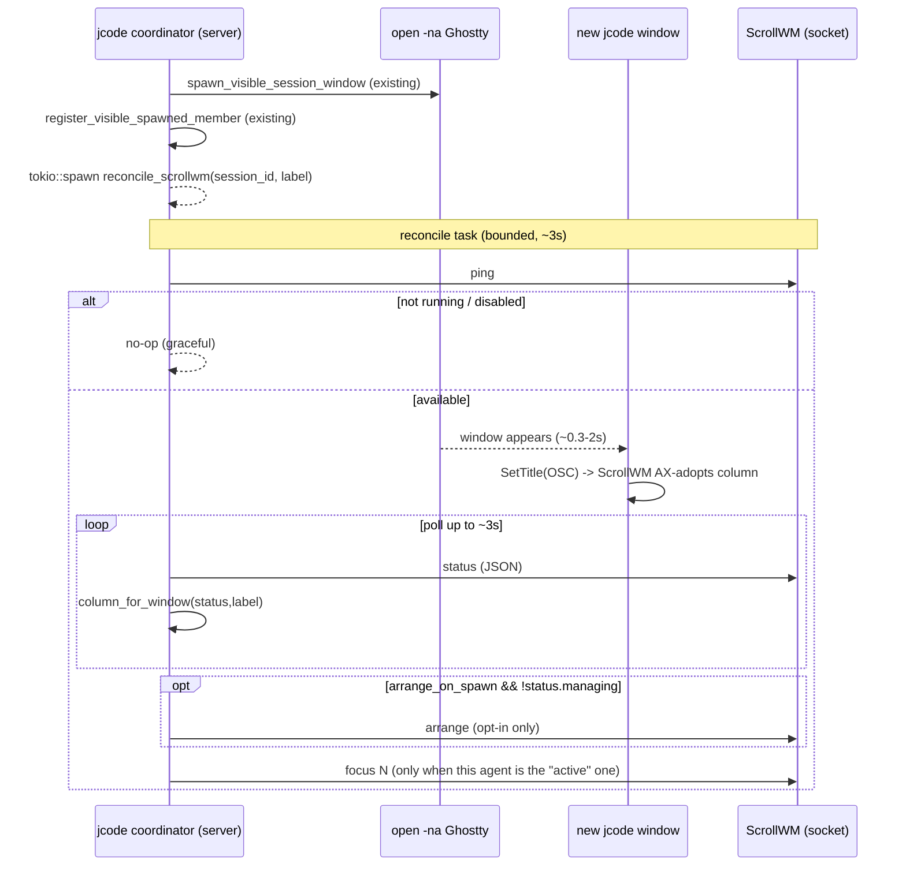

# Explorer: swarm-orchestration (jcode → ScrollWM)

How jcode's multi-agent swarm (headed/visible spawns) should drive ScrollWM so
each spawned agent window lands in a strip column (and optionally a workspace),
and how jcode focuses the active agent's window.

Scope: the **TUI/CLI agent** (root jcode), package `jcode`. Read-only study; no
production code changed.

---

## 1. What actually happens today (code anchors)

### jcode visible-spawn pipeline
`swarm spawn` / `fill_slots` / `run_plan` (coordinator) emits a `CommSpawn`
request that lands here:

- `crates/jcode-app-core/src/server/client_lifecycle.rs:2044`
  — `Request::CommSpawn { … spawn_mode }` → `parse_swarm_spawn_mode` →
  `handle_comm_spawn`.
- `crates/jcode-app-core/src/server/comm_session.rs:694` — `handle_comm_spawn`
  (idempotency key, coordinator guard) → `spawn_swarm_agent`.
- `comm_session.rs:469` — `spawn_swarm_agent`. Resolves `SwarmSpawnMode`
  (`comm_session.rs:494`: `spawn_mode.unwrap_or(agents_config.swarm_spawn_mode)`),
  then for `Visible | Auto` calls `prepare_visible_spawn_session(…, spawn_visible_session_window)`
  (`comm_session.rs:514-525`).
- `comm_session.rs:348` — `prepare_visible_spawn_session`: creates the persisted
  session, persists a headed startup message, then runs the launch closure.
- `comm_session.rs:96` — `spawn_visible_session_window` → 
  `session_launch::spawn_resume_in_new_terminal_with_provider`.
- `crates/jcode-app-core/src/session_launch.rs:77` — builds a `TerminalCommand`
  (`--fresh-spawn --resume <id>`, title from `resumed_window_title`) and calls
  `terminal_launch::spawn_command_in_new_terminal`.
- `crates/jcode-terminal-launch/src/lib.rs:293` — macOS Ghostty branch:
  `open -na Ghostty --args -e /bin/bash -lc '<jcode --resume …>'`.
- Back in `spawn_swarm_agent`, on success the member is registered as visible:
  `register_visible_spawned_member` (`comm_session.rs:396`, called at
  `comm_session.rs:587-601`) with `is_headless: false`, a `friendly_name`
  (`crate::id::extract_session_name`), `status = spawned|running`. This is the
  natural hook point for ScrollWM reconcile.

Key properties:
- The launch is **fire-and-forget**: `open -na Ghostty …` returns immediately;
  the new jcode process boots in its own window asynchronously (~0.3–2 s).
- The spawned jcode sets its **terminal/window title** via OSC (crossterm
  `SetTitle`) in `update_terminal_title`
  (`crates/jcode-tui/src/tui/app/tui_lifecycle_runtime.rs:64`), format roughly
  `"<icon> jcode <session-label>"` (+ `" [self-dev]"` for canary). Title is also
  `resumed_window_title` (`session_launch.rs:33`). **ScrollWM reads exactly this
  AX title**, so jcode already names its windows in a matchable way.
- `friendly_name` (e.g. `swarm-orchestration`) is the swarm-facing identity and
  is derivable from the session id; it appears inside the session label.

### ScrollWM control plane (what we can drive)
- Socket: `~/Library/Application Support/ScrollWM/control.sock`, override
  `SCROLLWM_CONTROL_SOCK` (`Sources/WindowLab/ControlServer.swift:21`). Line
  protocol: connect → write `"<verb> args\n"` → `shutdown(WR)` → read one reply
  line. `chmod 0600`, owner-only.
- Verbs (`Sources/WindowLab/ControlCommands.swift:15`): `ping`(→`pong`),
  `status`(→JSON), `arrange`, `release`, `toggle`, `focus <next|prev|left|right|N>`,
  `move <left|right|up|down>`, `workspace <up|down|N>`, `width <25|50|75|100|f>`,
  `close`, `display`, `focus-mode`, `reload`, `update`, `quit`.
- `status` JSON (`controlStatusJSON` `ControlCommands.swift:158` +
  `controlColumns` `ScrollWMApp.swift:970`) returns, when managing:
  `managing`, `windowCount`, `focusedColumn`, `workspace`, `workspaceCount`,
  and `columns: [{ index, app, title, width, focused, healthy }]`. **This is the
  bridge**: jcode can map `session → column index` by matching `title`/`app`.
- New-window auto-adopt: while ScrollWM `isManaging`, a freshly opened window is
  adopted automatically right-of-focus via the `kAXWindowCreated` observer +
  `LifecycleMonitor.resync` (`Sources/WindowLab/LifecycleMonitor.swift:146,245`),
  snapped to `spawnWidth` (`TeleportEngine.adopt`/`applySpawnWidth`). So if
  ScrollWM is already managing, **jcode does not need to place windows at all** —
  they land in columns in spawn order; jcode only needs to (optionally) focus.
- The `scrollwm` CLI shim (`Sources/WindowLab/ControlCLI.swift`) is on PATH at
  `/opt/homebrew/bin/scrollwm`; `arrange`/`toggle` will even launch the app.

### Two facts that shape the design (verified live)
1. **Socket presence ≠ app running.** On this machine the socket file exists but
   `scrollwm ping` reports "isn't running" (stale socket → `connect()` returns
   `ECONNREFUSED`). Presence MUST be probed with `ping`→`pong`, never `stat`.
   `ControlClient.send` already maps `ENOENT`/`ECONNREFUSED` → `notRunning`
   (`ControlServer.swift:173-176`).
2. **`scrollwm focus` is column-index / next-prev only** — there is no
   focus-by-title/app verb. To "focus the active agent's window" jcode must read
   `status`, find the column whose `title` matches the agent's window, then
   `focus N`. (Alternatively add a `focus-window <substr>` verb to ScrollWM; see
   alternatives.)

---

## 2. Design

### 2.1 New thin client in jcode: `scrollwm` control module
Add `crates/jcode-app-core/src/scrollwm.rs` (mirrors ScrollWM's `ControlClient`
in ~120 lines of std `UnixStream`; no new deps). Public surface:

```rust
pub struct Scrollwm { sock: PathBuf }            // resolves SCROLLWM_CONTROL_SOCK or default
impl Scrollwm {
    pub fn resolve() -> Self;                    // env override → ~/Library/Application Support/ScrollWM/control.sock
    pub fn available(&self) -> bool;             // send("ping") == "pong"; false on ENOENT/ECONNREFUSED/timeout
    pub fn send(&self, line: &str) -> Result<String>;   // connect, write+\n, shutdown(WR), read, ~250ms timeout
    pub fn status(&self) -> Result<ScrollwmStatus>;     // parse status JSON
    pub fn arrange(&self) -> Result<String>;
    pub fn focus_column(&self, one_based: usize) -> Result<String>;
}

// PURE, unit-testable: pick the column for a spawned agent window.
pub fn column_for_window(status: &ScrollwmStatus, want: &WindowMatch) -> Option<usize>;
```

Why a direct socket (not shelling `scrollwm`): synchronous, no PATH dependency,
no `open`/launch side effects, trivially graceful when absent. Keep an optional
`scrollwm` CLI fallback only if the binary is found and the socket call fails.

### 2.2 Window matching (naming so ScrollWM can match)
jcode already sets a matchable title. To make matching robust and cheap, match
on **`app == "Ghostty"` (or the resolved terminal) AND `title` contains the
agent's session label/short-id**. The session short-id is unique and already in
`resumed_window_title` via `terminal_session_label_for_id`
(`crates/jcode-base/src/process_title.rs:55`). 

Hardening (small, optional follow-up): inject a stable, greppable marker into the
spawned window title, e.g. prefix `jcode:<shortid>`, or pass an env var
`JCODE_SCROLLWM_TAG=<shortid>` into the Ghostty spawn so the title is
deterministic even before the agent renders its own title. `WindowMatch` carries
`{ app: Option<&str>, title_contains: Vec<String> }` and `column_for_window`
prefers an exact tag hit, then falls back to session-label substring.

### 2.3 Reconcile flow (after spawn)
Hook a non-blocking reconcile right after `register_visible_spawned_member`
(`comm_session.rs:587`). Do NOT block the spawn path on socket/window I/O.



Reconcile algorithm (`reconcile_scrollwm_after_spawn`):
1. Gate on config (`integrations.scrollwm.enabled`) and `available()` (ping).
   Absent/disabled → return (no-op).
2. Read `status`. If `!managing`: with default config, **do nothing** (auto-adopt
   only happens while managing). If `arrange_on_spawn` is opted in, call
   `arrange` once to start managing (caveat: arrange adopts the *whole current
   Space* — see Risks).
3. Poll `status` (e.g. 6×500 ms) until `column_for_window` resolves the new
   agent's column (the window may not exist yet). On miss after the budget, stop
   quietly — the window still got auto-adopted; we just don't force focus.
4. Focus policy: only `focus N` when this agent should be the active/foreground
   one. Default: focus the **just-spawned** agent (matches niri/PaperWM "follow
   the newest window"), which is also ScrollWM's own auto-adopt behavior, so this
   is usually a no-op confirm. A future `swarm focus <agent>` could drive
   `focus_column` for the user's chosen active agent.

### 2.4 Per-agent column / workspace assignment
- **Columns (default, minimal):** spawning N agents sequentially yields N
  Ghostty windows; ScrollWM auto-adopts each right-of-focus, so columns come out
  in spawn order with zero placement code. Good enough for v1.
- **Workspaces (opt-in, later):** to put each agent (or each batch) on its own
  vertical workspace, after focusing the agent's column call
  `move down` (`moveFocusedToWorkspace`) or `workspace N`. e.g. coordinator on
  ws1, workers fanned across ws2…wsN. Keep behind config; it reorders the user's
  view and is easy to get wrong.

### 2.5 Config + env
Add to `AgentsConfig`/a new `IntegrationsConfig` in
`crates/jcode-config-types/src/lib.rs` (next to `SwarmSpawnMode`,
`config-types:407`):

```rust
pub struct ScrollwmConfig {
    pub enabled: bool,            // default false (opt-in); "auto" = use if ping ok
    pub arrange_on_spawn: bool,   // default false (don't grab the user's desktop)
    pub focus_active: bool,       // default true: focus the spawned/active agent
    pub workspaces: bool,         // default false: per-agent workspace fan-out
}
```
Env overrides for quick testing: `JCODE_SCROLLWM=1`, `JCODE_SCROLLWM_ARRANGE=1`,
mirroring existing env-over-config patterns.

---

## 3. API / data-flow sketch (jcode side)

```
spawn_swarm_agent (comm_session.rs:469)
  └─ register_visible_spawned_member (…:587)
       └─ tokio::spawn reconcile_scrollwm_after_spawn(session_id, friendly_name)
            ├─ cfg = config().integrations.scrollwm   (gate)
            ├─ sw = Scrollwm::resolve(); if !sw.available() { return }   // ping
            ├─ st = sw.status()?  →  ScrollwmStatus { managing, columns[…] }
            ├─ (opt-in) if cfg.arrange_on_spawn && !st.managing { sw.arrange()?; }
            ├─ poll: column_for_window(&st, &WindowMatch{ app:"Ghostty",
            │                       title_contains:[shortid, label] })
            └─ if cfg.focus_active && let Some(n) = col { sw.focus_column(n)?; }
```

`ScrollwmStatus` = thin serde struct over the `status` JSON
(`{ managing, windowCount, focusedColumn, columns:[{index,app,title,focused}] }`).
`column_for_window` is a pure function → unit-testable from canned JSON.

---

## 4. Risks / edge cases

- **`arrange` grabs the whole Space, not just jcode windows.** `arrange`
  (`ScrollWMApp.swift:645`) adopts *every* manageable current-Space window
  (the user's editor, browser, …) into the strip. Auto-triggering it from a
  swarm spawn would rearrange the user's entire desktop. Mitigation: default
  `arrange_on_spawn=false`; rely on auto-adopt when the user has *already*
  arranged. Never call `arrange` implicitly.
- **Async window appearance → focus race.** Window/title may lag the socket
  call by up to ~2 s. Mitigation: bounded `status` poll keyed on title match;
  give up silently (the window is still adopted).
- **Stale socket.** Must `ping` (not `stat`); `ECONNREFUSED`/`ENOENT`/timeout →
  treat as absent. Use a short connect/read timeout (~250 ms) so a wedged app
  never stalls a spawn.
- **Focus-by-index drift.** Column indices change as windows are added/closed.
  Always re-derive N from a fresh `status` title match immediately before
  `focus N`; never cache N.
- **Title collisions.** Two agents in the same repo share a similar label;
  disambiguate with the session short-id (unique) and prefer it in matching.
- **Multi-display / multi-workspace.** `status.columns` reflect the active
  strip/workspace only; on multi-display the agent may be on another strip.
  v1: best-effort, no-op on miss.
- **Don't block / don't panic the server.** All ScrollWM I/O on a detached
  task with timeouts; every error path is a quiet no-op + one log line.
- **Safety contract.** jcode only ever drives ScrollWM's *control plane*; it
  never enumerates/moves windows itself. ScrollWM's sandbox/Space rules remain
  authoritative. Tests use `SCROLLWM_CONTROL_SOCK` to point at a sandbox app
  (`WindowLab sandbox`) — never the real session.

### Alternatives considered
- **Add `focus-window <substr>` + `arrange-mine <pidlist>` verbs to ScrollWM.**
  Cleaner long-term (jcode passes the spawned PID/title; ScrollWM matches and can
  scope adoption to jcode's own windows, avoiding the "grab whole desktop"
  problem). Recommended as the *second* PR, on the ScrollWM side. jcode already
  knows spawned PIDs are unavailable from `open -na` directly, but the new
  window's title/app are enough to match.
- **Shell out to `scrollwm <verb>`** instead of a socket client: simplest, but
  PATH-dependent, spawns a process per call, and `arrange`/`toggle` can *launch*
  the app (unwanted side effect). Use only as fallback.
- **niri-style `spawn` binding** (the commented `ctrl+opt+j` in
  `Config.swift:539`): user-driven, not swarm-driven; orthogonal to this.

---

## 5. Minimal first PR

Ship the smallest safe, useful slice: **detect ScrollWM, focus the freshly
spawned agent's column; never rearrange the user's desktop.**

1. `crates/jcode-app-core/src/scrollwm.rs` (new): `Scrollwm` UnixStream client
   (`resolve`, `available`/ping, `send`, `status`) + `ScrollwmStatus` serde + the
   pure `column_for_window`. Register `pub mod scrollwm;` in the crate.
2. `crates/jcode-config-types/src/lib.rs`: add `ScrollwmConfig { enabled=false,
   arrange_on_spawn=false, focus_active=true, workspaces=false }` under a new
   `integrations` field; env overrides `JCODE_SCROLLWM*`.
3. `comm_session.rs` `spawn_swarm_agent`: after `register_visible_spawned_member`
   (`:587`), `tokio::spawn(reconcile_scrollwm_after_spawn(session_id, label))`
   that gates on config + `available()`, polls `status` for the agent's column by
   title/short-id, and `focus_column(n)` when `focus_active`. No `arrange` unless
   `arrange_on_spawn` is explicitly on. Pure no-op when ScrollWM is absent.
4. Tests: unit-test `column_for_window` against canned `status` JSON (exact tag,
   label-substring, no-match). Manual/throwaway probe against `WindowLab sandbox`
   + `SCROLLWM_CONTROL_SOCK` to confirm ping/status/focus round-trips.

Deliberately deferred to follow-ups: `arrange_on_spawn`, per-agent workspaces,
the title `jcode:<shortid>` marker / `JCODE_SCROLLWM_TAG`, and the ScrollWM-side
`focus-window` / scoped `arrange-mine` verbs.
